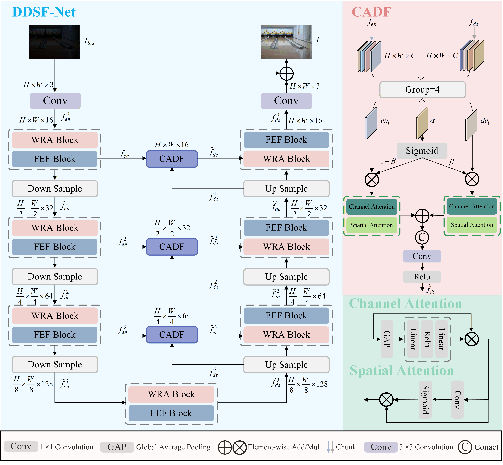

# DDSF-Net: A Dual-Domain Collaborative Spatial–Frequency Network for Low-Light Image Enhancement

---

## Network Architecture

The overall architecture of DDSF-Net is illustrated below.

<p align="center">
  
</p>

---

## Key Modules

The structures of the proposed modules are shown below.

<p align="center">
  
</p>

---

## Visual Results

Qualitative comparison results on representative low-light scenes.

<p align="center">
  
</p>

<p align="center">
  
</p>

---

## Training

To train DDSF-Net, run:

```bash
python train.py
