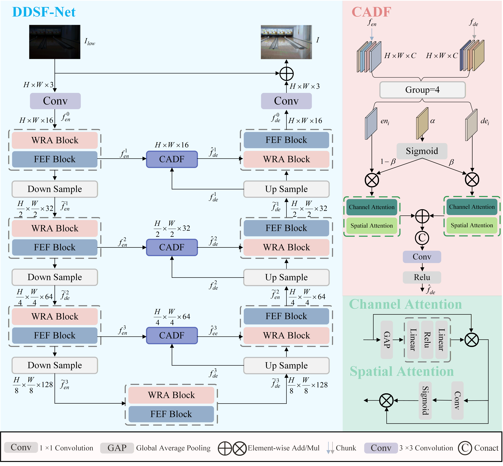

# DDSF-Net: A Dual-Domain Collaborative Spatial–Frequency Network for Low-Light Image Enhancement

> This repository provides a partial implementation of our work **"DDSF-Net: A Dual-Domain Collaborative Spatial–Frequency Network for Low-Light Image Enhancement"**, intended for academic communication and preliminary understanding.  
> To protect the originality of our work and ensure compliance with publication requirements, the **complete codebase and pretrained models will be released after the paper is officially accepted**.  
> We appreciate your understanding and support.

---

## 🔹 Framework Overview

The overall architecture of **DDSF-Net** is illustrated in the figure below.

DDSF-Net adopts an encoder–decoder architecture and integrates Fourier-domain global illumination modeling, wavelet-domain directional detail reconstruction, and adaptive cross-level feature fusion for efficient low-light image enhancement.

<p align="center">
  
  <br/>
  <em>Fig. 1: Overall architecture of DDSF-Net. The network consists of Fourier Enhancement Fusion Block (FEFB), Wavelet Reconstruction Attention Block (WRAB), and Context-Aware Detail Fusion (CADF) modules.</em>
</p>

---

## 🔹 Key Modules

The structures of the proposed key modules are shown below.

DDSF-Net mainly includes the following modules:

- **Fourier Enhancement Fusion Block (FEFB)** for efficient global illumination modeling and spatial–frequency feature collaboration.
- **Wavelet Reconstruction Attention Block (WRAB)** for direction-sensitive edge and texture reconstruction.
- **Context-Aware Detail Fusion (CADF)** for adaptive encoder–decoder feature fusion and degradation suppression.

<p align="center">
  
  <br/>
  <em>Fig. 2: Structures of the proposed WRAB and FEFB modules.</em>
</p>

---

## 🔹 Dataset

Please download the datasets from their official sources or commonly used public dataset repositories, and organize them according to the required directory structure.

This project uses the following datasets:

- **LOL-v1**: https://daooshee.github.io/BMVC2018website/
- **LOL-v2-Real**: https://github.com/flyywh/CVPR-2020-Semi-Low-Light
- **LIME**: https://sites.google.com/view/xjguo/lime
- **MEF**: https://ivc.uwaterloo.ca/database/MEF.html
- **NPE**: Please refer to common low-light image enhancement dataset collections.
- **DICM**: Please refer to common low-light image enhancement dataset collections.
- **VV**: https://sites.google.com/site/vonikakis/datasets
- **DarkFace**: https://flyywh.github.io/CVPRW2019LowLight/

The paired datasets, including **LOL-v1** and **LOL-v2-Real**, are used for quantitative evaluation with full-reference metrics. The unpaired datasets, including **LIME**, **MEF**, **NPE**, **DICM**, and **VV**, are used for qualitative and no-reference evaluation. **DarkFace** is used to evaluate the effectiveness of enhanced images for downstream low-light face detection.

---

## 🔹 Model Training

To train **DDSF-Net**, run:

```bash
python train.py
